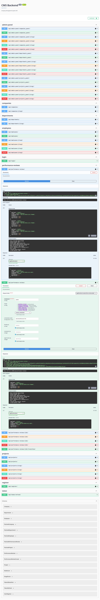

# Company Management System – Backend

Access the deployed backend and API documentation:  
**[http://34.89.210.188/api/docs/](http://34.89.210.188/api/docs/)**

---

## 🚀 Quick Start

1. **Register** a new user (choose role: admin, manager, or employee).
2. **Log in** to obtain your JWT token.
3. In Swagger UI, click **"Authorize"** and paste your token.
4. Explore and test the API endpoints.

---

## ✅ Feature Checklist

- CRUD for all entities
- Role-based access control
- JWT authentication
- Employee performance review workflow
- RESTful API
- API documentation (Swagger & ReDoc)
- Logging
- Unit & integration tests

---

## 🖼️ Screenshots




---

## 📚 Overview

A robust backend for a Company Management System built with Django and Django REST Framework. Features include role-based access control, secure JWT authentication, and a comprehensive employee performance review workflow. Supports CRUD operations for companies, departments, employees, and projects, with RESTful APIs and logging for error tracking.

---

## 📑 Table of Contents

- [Features](#features)
- [Architecture](#architecture)
- [Data Models](#data-models)
- [Employee Performance Review Workflow](#employee-performance-review-workflow)
- [Security & Permissions](#security--permissions)
- [RESTful API](#restful-api)
- [Testing](#testing)
- [Logging](#logging)
- [Setup & Installation](#setup--installation)
- [Usage](#usage)
- [API Documentation](#api-documentation)
- [Screenshots](#screenshots)
- [Checklist](#feature-checklist)
- [License](#license)

---

## ✨ Features

- CRUD operations for Companies, Departments, Employees, and Projects
- Employee performance review workflow with approval stages
- Role-based access control (Admin, Manager, Employee)
- Secure JWT authentication & authorization
- RESTful API for all entities
- API documentation (Swagger & ReDoc)
- Logging for error tracking and application behavior

---

## 🏗️ Architecture

- **Django**: Web framework for rapid development
- **Django REST Framework**: For building RESTful APIs
- **JWT Authentication**: Secure token-based authentication
- **Modular Apps**: `user`, `company`, `performance_review`
- **SQLite**: Default database (easily swappable for PostgreSQL/MySQL)
- **Logging**: Configured for application and error logs

---

## 🔄 Employee Performance Review Workflow

**Stages:**
1. Pending Review
2. Review Scheduled
3. Feedback Provided
4. Under Approval
5. Review Approved
6. Review Rejected

**Transitions:**
- Pending Review → Review Scheduled
- Review Scheduled → Feedback Provided
- Feedback Provided → Under Approval
- Under Approval → Review Approved / Review Rejected
- Review Rejected → Feedback Provided

---

## 🔒 Security & Permissions

- Role-based access control: Admin, Manager, Employee
- JWT authentication for all endpoints
- Managers access their department's data; employees access their own
- Secure password storage and validation

---

## 🌐 RESTful API Endpoints

**Company**
- `GET /api/companies/` — List all companies
- `GET /api/companies/<slug>/` — Retrieve a company

**Department**
- `GET /api/departments/` — List all departments
- `GET /api/departments/<slug>/` — Retrieve a department

**Employee**
- `POST /api/employees/` — Create employee
- `GET /api/employees/` — List employees
- `GET /api/employees/<slug>/` — Retrieve employee
- `PATCH /api/employees/<slug>/` — Update employee
- `DELETE /api/employees/<slug>/` — Delete employee

**Project**
- `POST /api/projects/` — Create project
- `GET /api/projects/` — List projects
- `GET /api/projects/<slug>/` — Retrieve project
- `PATCH /api/projects/<slug>/` — Update project
- `DELETE /api/projects/<slug>/` — Delete project

**Performance Review**
- `GET /api/performance-reviews/` — List reviews (filtered by role)
- `POST /api/performance-reviews/` — Create review
- `PATCH /api/performance-reviews/<id>/transition/` — Transition review stage

**Authentication**
- `POST /api/register/` — Register user
- `POST /api/login/` — Obtain JWT token
- `POST /api/token/refresh/` — Refresh JWT token

> **Note:**  
> - API follows RESTful conventions  
> - Handles data securely  
> - API docs: `/api/docs/` (Swagger), `/api/redoc/` (ReDoc)

---

# 🛠️ Setup & Installation

This guide explains how to set up and run the project on **Windows** and **Linux**.

---

## 📌 Prerequisites

- [Python 3.10+](https://www.python.org/downloads/)
- [Git](https://git-scm.com/downloads)
- [pip](https://pip.pypa.io/en/stable/installation/) (comes with Python)
- [virtualenv](https://virtualenv.pypa.io/en/latest/) (recommended)

---

## 1️⃣ Clone the Project

```bash

git clone https://github.com/AhmedHashim04/CMS-backend-Django-Based-App.git src
```

---

## 2️⃣ Create Virtual Environment


```bash
python -m venv venv
mv src venv
cd venv
```

**Windows:**
```bash
Scripts\activate
```

**Linux/macOS:**
```bash
source venv/bin/activate
```

---

## 3️⃣ Install Dependencies

```bash
pip install --upgrade pip
pip install -r requirements.txt
```

---

## 4️⃣ Database Setup

**Default:** Uses SQLite (no extra setup needed).

---

## 5️⃣ Apply Migrations

```bash
python manage.py migrate
```

---

## 6️⃣ Create Superuser

```bash
python manage.py createsuperuser
```

---

## 7️⃣ Run Development Server

```bash
python manage.py runserver
```

Visit:  
[http://127.0.0.1:8000/api/docs/](http://127.0.0.1:8000/api/docs/)  
Test all endpoints here.

---

## 8️⃣ Run Tests

```bash
pytest
```

---

## 9️⃣ Static & Media Files (Optional)

```bash
python manage.py collectstatic
```

---

## 🔧 Linux Permissions (if needed)

```bash
chmod +x manage.py
```

---

## 🐳 Docker Setup (Optional)

You can run the project using Docker for easier setup and isolation.

### 1. Remove Existing Container (if any)

```bash

sudo docker rm -f django-app
```
### 2. Build Docker Image

```bash
cd src
sudo docker build -t my-django-app .
```


### 3. Run Docker Container

```bash
sudo docker run -d -p 8000:8000 --name django-app --restart unless-stopped my-django-app
```

API available at:  
[http://127.0.0.1:8000/api/docs/](http://127.0.0.1:8000/api/docs/)

### 4. Run Migrations (inside container)

```bash
docker exec -it django-app python manage.py migrate
```

### 5. Create Superuser (inside container)

```bash
docker exec -it django-app python manage.py createsuperuser
```

> **Note:**  
> Ensure you have a valid `Dockerfile`.

---

## ✅ Summary

1. Clone project  
2. Create virtual environment  
3. Install dependencies  
4. Setup database & environment variables  
5. Run migrations  
6. Create superuser  
7. Start server 🚀  
8. (Optional) Use Docker

---

## 📄 License